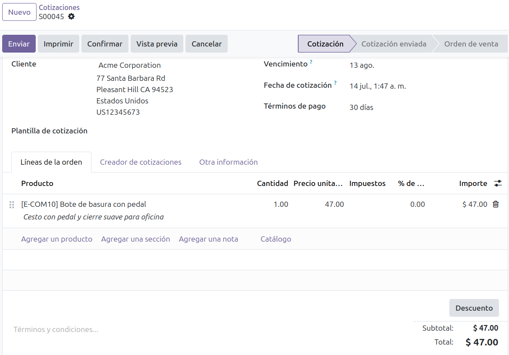
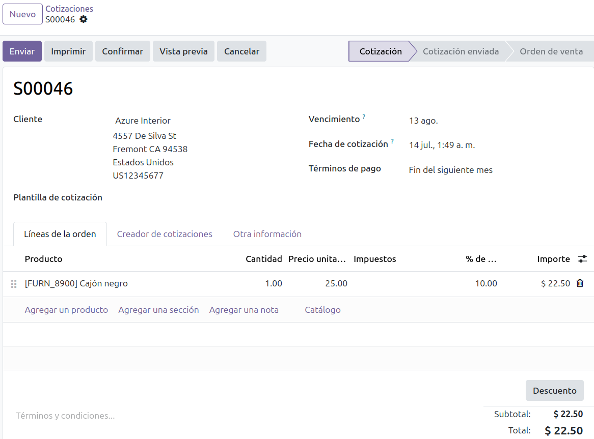
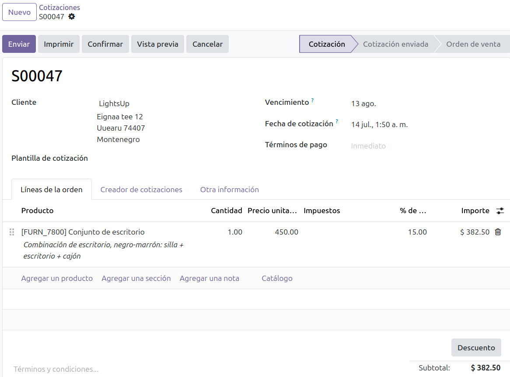
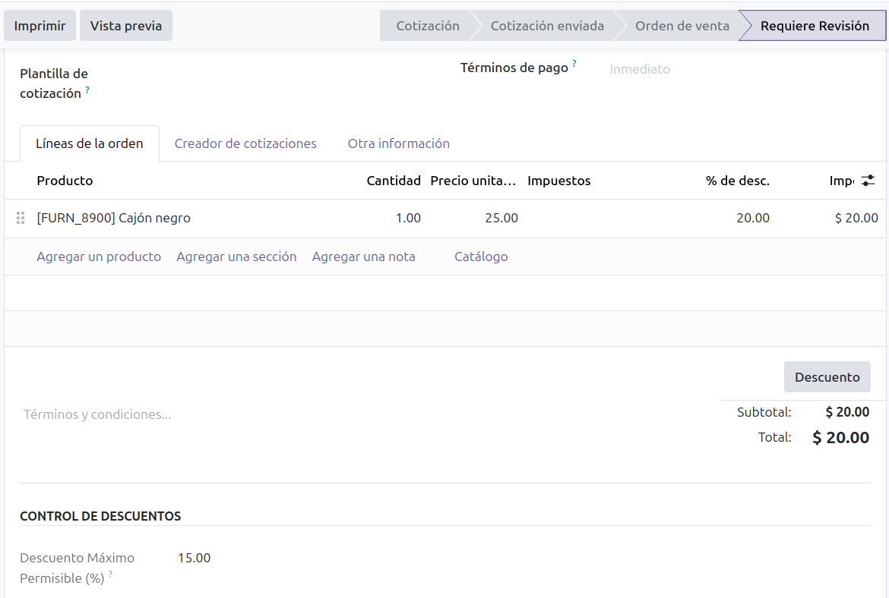
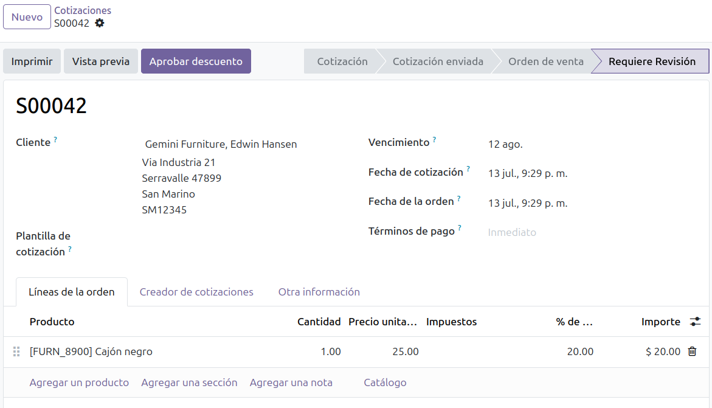
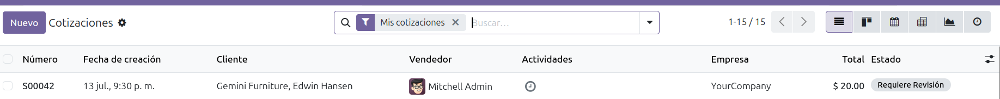
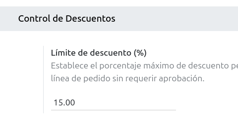
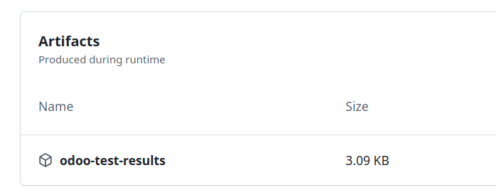

# Informe de Aseguramiento de la Calidad (QA) Final - Sprint 4

**Proyecto:** Extensión de Control de Descuentos en Odoo 19.0
**Repositorio:** odooIPS
**Responsable de QA:** Aarón Fernando Quiñonez Delgado (aaronQuinonez)
**Fecha de Consolidación:** 14 de Julio de 2026

---

## 1. Objetivo

El objetivo de este documento es consolidar y presentar la evidencia final de pruebas (QA) correspondientes al Sprint 4. Esto busca certificar que las reglas de negocio para la retención y aprobación de descuentos excepcionales operan sin errores lógicos, garantizando que el flujo de trabajo cumpla con los estándares de calidad definidos para la entrega final al docente evaluador.

## 2. Alcance

El proceso de control de calidad abarca:

- La validación de la lógica del backend de Odoo al aplicar descuentos en líneas de venta.
- El correcto funcionamiento de la interfaz de usuario (ocultamiento/renderizado dinámico de botones de aprobación).
- La consistencia de los permisos de acceso y las restricciones de seguridad basadas en roles (Vendedor vs. Supervisor).
- La verificación automatizada a través de la ejecución del pipeline de Integración Continua (CI/CD).

## 3. Ambiente de Pruebas

Para garantizar la fidelidad de las pruebas y la reproducibilidad de los resultados, se empleó el siguiente entorno:

- **Motor ERP:** Odoo 19.0 (Comunidad) desplegado sobre contenedores Docker.
- **Base de Datos:** PostgreSQL 15.17 (`odoo_ventas`).
- **Sistema Operativo de Pruebas:** Ubuntu Linux (entorno local de desarrollo).
- **Pipeline de Integración Continua (CI/CD):** GitHub Actions con runner `ubuntu-latest`.
- **Método de Prueba:** Pruebas funcionales manuales (Black Box) complementadas con la ejecución de scripts de prueba automatizados en el pipeline.

## 4. Matriz de Casos de Prueba (QA Matrix)

A continuación, se detalla la matriz de ejecución de los escenarios mínimos requeridos para la validación del sistema:

| ID | Escenario | Precondición | Pasos | Resultado Esperado | Resultado Obtenido | Evidencia |
|---|---|---|---|---|---|---|
| TC-01 | Pedido sin descuento | El usuario (Vendedor) tiene sesión activa. El descuento máx. está configurado en 15%. | 1. Crear presupuesto. 2. Agregar producto con 0% desc. 3. Guardar cotización. | El presupuesto se guarda en estado "Cotización" de forma regular. | Exitoso. El documento se guardó en estado borrador sin alertas. |  |
| TC-02 | Descuento menor al límite | Descuento máximo permitido configurado en 15%. | 1. Crear presupuesto. 2. Agregar producto con 10% desc. 3. Guardar cotización. | El presupuesto se guarda en estado "Cotización" directamente sin disparar bloqueos. | Exitoso. No se generó retención; el flujo comercial continúa normal. |  |
| TC-03 | Descuento igual al límite | Descuento máximo permitido configurado en 15%. | 1. Crear presupuesto. 2. Agregar producto con 15% desc. 3. Guardar cotización. | El presupuesto se guarda y procesa con normalidad al no superar el umbral. | Exitoso. El límite de 15% inclusive fue respetado sin bloquear el flujo. |  |
| TC-04 | Descuento mayor al límite | Descuento máximo permitido configurado en 15%. | 1. Crear presupuesto. 2. Agregar producto con 20% desc. 3. Guardar cotización. | El presupuesto cambia automáticamente su estado a "Requiere Revisión" y se bloquea. | Exitoso. Estado cambiado a "Requiere Revisión" y controles de venta bloqueados. |  |
| TC-05 | Aprobación por supervisor | Cotización en estado "Requiere Revisión". Usuario logueado con rol de Supervisor. | 1. Abrir cotización bloqueada. 2. Hacer clic en el botón azul "Aprobar descuento". 3. Guardar cambios. | El estado de la cotización cambia de "Requiere Revisión" a "Cotización" (desbloqueado). | Exitoso. El botón procesó la aprobación y liberó el presupuesto de inmediato. |  |
| TC-06 | Usuario sin permisos | Cotización en estado "Requiere Revisión". Usuario logueado es un Vendedor común. | 1. Abrir cotización bloqueada. 2. Verificar elementos visuales. | El botón "Aprobar descuento" no debe renderizarse ni estar disponible para este usuario. | Exitoso. El botón "Aprobar descuento" permaneció invisible en la interfaz del vendedor. |  |
| TC-07 | Límite configurable | Acceso como Administrador del sistema. | 1. Ir a Ajustes de Ventas. 2. Cambiar límite de descuento de 15% a 25%. 3. Intentar venta con 20% desc. | La venta con 20% de descuento ahora debe pasar sin bloquearse al ser menor que el nuevo límite. | Exitoso. El sistema se adaptó dinámicamente al nuevo parámetro de base de datos. |  |
| TC-08 | Ejecución del pipeline | Push o Pull Request hacia la rama main o develop. | 1. Monitorear pestaña "Actions" en GitHub. 2. Verificar ejecución de tests automatizados. | El pipeline corre los tests, compila el módulo y termina en estado exitoso. | Exitoso. Integración exitosa, linter y tests del modelo de descuentos superados. |  |

## 5. Resultados del Sprint 4 y Evidencias de Integración Continua

### Integración Continua (CI/CD) y Artifacts

Para validar la integridad del software de forma independiente a la máquina de desarrollo, se configuró un pipeline en GitHub Actions.

- **Workflow de Validación:** Puedes consultar el pipeline ejecutado de forma transparente en el siguiente enlace: *Workflow Run - Sprint 4 Validation*
- **Resultado de Pruebas (Artifact):** El resultado detallado de las pruebas unitarias y de integración del framework de Odoo ha sido empaquetado y subido por el pipeline.

## 6. Riesgos Residuales Transparentes

Para asegurar una evaluación honesta y transparente al docente, se listan los siguientes riesgos identificados que quedan fuera del alcance automatizado de esta entrega:

1. **Expiración de Artifacts en GitHub:** Los archivos de pruebas automatizadas (`odoo-test-results`) almacenados por GitHub Actions tienen un tiempo de vida predeterminado (típicamente 90 días). Si el evaluador accede después de este periodo, los archivos no estarán descargables, requiriendo re-ejecutar el pipeline para volver a generarlos.

2. **Dependencias del Entorno Docker:** El sistema se validó localmente bajo contenedores Docker y en la arquitectura de integración de GitHub Actions. Variaciones extremas de red, direccionamiento de puertos locales o límites de memoria en otras estaciones de trabajo podrían requerir reconfiguraciones menores de Docker Compose.

3. **Pruebas de Interfaz Manuales (UI):** Mientras que la lógica de retención (ORM) y permisos de escritura en la base de datos están completamente validadas mediante pruebas, los aspectos visuales del renderizado del botón dependiente del widget en navegadores antiguos no están cubiertos por pruebas automatizadas y requieren verificación visual humana.
